### Đây là một bài review lại bài báo của các tác giả Iman Sharafaldin, Amirhossein Gharib, Arash Habibi Lashkari and Ali A. Ghorbani. Mục đích là để tìm hiểu kỹ thuật tạo B-Profile nhằm dùng thuật toán để gom nhóm hành vi bình thường, phục vụ cho dự án của EdgeAI Lab.

**Nhận định:** Để đánh giá hiệu năng của một hệ thống phát hiện xâm nhập mạng thì cách lý tưởng nhất là sử dụng lưu lượng mạng thực tế đã được gắn nhãn, có khả năng phản ánh đầy đủ dấu hiệu của các hành vi bất thường hay bình thường.

> Tuy nhiên thì tính khả thi rất thấp, gần như bằng 0 do các ràng buộc, bí mật thuộc các tập đoàn và tổ chức. Do đó thì phần lớn sẽ phải phụ thuộc vào các tập dữ liệu chuẩn được công khai (thường không tối ưu, không phản ánh đúng tính chất mạng)

> Thêm một điều rút ra được là các mẫu hành vi, cấu trúc mạng, các cuộc tấn công liên tục biến đổi, nên việc phụ thuộc vào một tập dữ liệu tĩnh, thu thập một lần rồi sử dụng vĩnh viễn là không khả quan, thậm chí mang lại kết quả sai lệch khi áp dụng học máy.

### Phương pháp tạo B-Profile

**Giai đoạn khởi tạo:** Thu thập đặc trưng luồng và phương pháp biểu diễn chuỗi thời gian 48-cột

- Bước đầu tiên chính là giai đoạn lập hồ sơ cá nhân. Hệ thống phải quan sát người dùng thực trong một môi trường được kiểm soát chặt chẽ để thu thập dữ liệu về cách họ tương tác với các ứng dụng.

> Hệ thống bắt buộc phải quan sát người dùng thật ở giai đoạn đầu. Để tạo ra nền đủ đa dạng, hệ thống ước tính có thể cần phải quan sát hàng trăm, hàng ngàn người. Lý do là vì hành vi mạng của con người rất phong phú và thay đổi liên tục theo từng múi giờ, và sở thích cá nhân của mỗi người.

> Hệ thống sẽ ghi nhận hoạt động của các cá nhân trong suốt 24 giờ. Quá trình này diễn ra trong phòng thí nghiệm.

Tuy nhiên nếu làm theo cách trên thì thực sự là không tưởng về mặt thực tế.

**Do đó phương pháp này là không khả quan, ta sẽ đi theo cách sau:**

### Bước 1: Giám sát và thu thập dữ liệu thô

**1.** Khi hệ thống thu thập dữ liệu mạng, nó sẽ thiết lập bộ lọc để chỉ ghi nhận và phân tích lưu lượng đi qua các cổng (ports) của 5 nhóm giao thức và phớt lờ các luồng dữ liệu khác.

- HTTP / HTTPS (Port 80/443): Đại diện cho hành vi lướt web, mở trình duyệt.

- FTP (Port 20/21): Đại diện cho hành vi truyền tải, upload/download tệp tin nội bộ.

- SSH (Port 22): Đại diện cho hành vi thao tác terminal, điều khiển máy tính/máy chủ từ xa.

- Email (SMTP, IMAP, POP3): Đại diện cho hành vi gửi, nhận và đồng bộ thư điện tử.

**2.** Các phương pháp được sử dụng để thu thập dữ liệu: tấn công Man-in-the-Middle, đánh hơi mạng (network sniffing) và đối chiếu với lịch sử duyệt web cũng như email cua người dùng.

> Network Sniffing sẽ là phương pháp được sử dụng chủ yếu nhờ sự đơn giản của nó, và những lợi ích nó mang lại là vừa đủ. Tấn công Man-in-the-middle và đối chiếu lịch sử sễ chỉ được sử dụng ở mức phòng thí nghiệm, theo bài báo thì có thể là lên các tình nguyện viên hoặc chính các tác giả. Tuy nhiên 2 phương pháp này vẫn bắt buộc phải có.

**Giải thích 2 phương pháp**

**2.1** Network Sniffing: Hệ thống đóng vai trò như một người quan sát đứng bên lề đường, ghi chép lại lưu lượng giao thông truyền qua lại mà không hề can thiệp, chặn đứng hay làm thay đổi tốc độ của luồng dữ liệu. Các tác giả sẽ cài đặt các phần mềm hoặc thiết bị bắt gói tin (packet sniffer) tại các điểm định tuyến trung tâm của hệ thống mạng. Khi người dùng bình thường sử dụng mạng để lướt web, tải file hay gửi mail, thiết bị này sẽ tự động bắt và sao chép lại toàn bộ luồng dữ liệu đó. Nhờ vậy mà phuowg pháp này giải quyết được vấn đề số lượng người dùng mạng (Có thể lên đến 100-1000 để đảm bảo tính đa dạng).

**2.2** MITM: MITM là kỹ thuật chủ động can thiệp thẳng vào giữa đường truyền kết nối của người dùng và máy chủ đích. Phương pháp này được thiết lập và giới hạn nghiêm ngặt trong một môi trường thử nghiệm. Hệ thống của tác giả sẽ đóng giả làm trạm trung chuyển. Khi thiết bị của người dùng gửi yêu cầu ra internet, kết nối đó sẽ bị bẻ hướng đi qua máy của nhà nghiên cứu trước. Máy trung gian này sẽ nhận gói tin, giải mã chúng, ghi chép lại nội dung bên trong, sau đó mới đóng gói lại và gửi tiếp đến máy chủ đích thực sự. Vì phương pháp này đòi hỏi việc đọc nội dung bên trong các gói tin, nó chỉ có thể được sử dụng ở trong môi trường phòng thí nghiệm.

**Nhược điểm của Network Sniffing**: NS không thể nhìn thấy các Payload Patterns đối với các lệnh đặc thù.

**Nhược điểm đó có ảnh hưởng như nào đến quá trình nghiên cứu**: Mục đích sau đó chính là phân loại các gói tin cho chuẩn (Ta sẽ dùng công cụ CICFlowMEter). Công cụ này cần bắt được chữ ký của các giao thức không mã hóa hoặc các thao tác gửi lệnh quản trị để nhận diện chính xác hành vi đó là gì. Nếu không có ruột, NS chỉ thấy một đống gói tin bằng nhau và không biết đâu là lướt web, đâu là gửi lệnh quản trị.

**MIRTM giải quyết vấn đề đó như nào**: Đầu tiên các tác giả/ các tình nguyện viên sẽ đóng vai để thực hiện các thao tác. MITM đứng ở giữa bẻ khóa và nhìn ra các mẫu chuỗi byte đặc biệt. Làm nhiều lần như vậy, ta sẽ rút ra được các chữ ký đại diện cho từng loại hành động. Sau đó, ta đem tập hợp này để dạy cho CICFlowMeter. Nhờ đó mà mặc dù gói tin (do NS bắt) bị khóa một phần, CICFlowMeter vẫn sẽ đủ thông minh để đối chiếu các manh mối với từ điển do MITM cấp, nhận diện và dán nhãn luồng.

**3.** Cuối cùng, đầu ra của công đoạn này là các tệp dữ liệu mạng thô (PCAP) gồm vỏ ngoài của gói tin (nhờ NS) và danh sách Payload Patterns (nhờ MITM).

### Bước 2: Trích xuất Đặc trưng bằng CICFlowMeter.

**1.**: Chia luồng dữ liệu:

> CICFlowMeter gom tất cả các gói tin có chung 5 yếu tố (IP Nguồn, Cổng nguồn, IP Đích, Cổng đích, Giao thức) thành một luồng. Việc này nhằm chuyển đổi góc nhìn của hệ thống từ Packet-Level sang Flow-Level. Những thông số này được lấy từ NS.

**2.**: Trích xuất các đặc trưng cốt lõi:

> Đối với mỗi luồng đã gom được, CICFlowMeter phân tích tầng mạng (network layer) và tầng giao vận(transport layer) để tính toán ra hơn 80 đặc trưng thống kê và vật lý(Bài báo không nói rõ 80 đặc trưng này là gì, nhưng nó là các con số thống kê thiết kế sẵn trong phần mềm CICFlowMeter). Đối với việc chỉ xây dựng B-Profile thì tập trung vào các nhóm thông số bao gồm: thời lượng luồng, tổng số gói tin theo chiều đi/về, tổng kích thước gói tin theo chiều đi, các mẫu cụ thể trong payload và phân phối thời gian.

### Bước 3: Biểu Diễn Hành Vi Dưới Dạng Chuỗi Thời Gian.

**Mô tả qua ý tưởng:** Đầu vào cho bước này là các hành vi của người dùng liên quan đến các giao thức đã đề cập. Hoạt động mạng của mỗi người dùng được ghi lại hàng ngày (theo ngày và giao thức) và một biểu đồ tần suất của các sự kiện với 48 cột (mỗi 30 phút) được tính toán. Hình bên dưới hiển thị hồ sơ cá nhân của một người dùng trong một ngày.

**Bước 3.1**: Tác giả viết một hệ thống (có thể bằng python và dùng các thư viện như Pandas hoặc NukPy) để nạp file CSV (Đầu ra của CICFlowMeter). Hệ thống sẽ chạy lệnh drop để bỏ phần lớn các thông số không quan trọng (như độ dài header TCP, số lượng cờ URG...). Nó chỉ giữ lại các cột: Timestamp (thời gian), IP Nguồn, Giao thức, và 4 nhóm thông số hạt nhân: Thời lượng luồng (fl_dur), Dung lượng/Số gói tin (tot_fw_pk, tot_l_fw_pkt...), Nhịp độ (Request Time Dist), và Mẫu Payload.

**Bước 3.2**: Tách nhóm theo đối tượng và hành vi: Vì lúc này tập dữ liệu rất lộn xộn: các luồng mạng (network flows) của tất cả người dùng trong hệ thống và mọi loại tác vụ mạng đang nằm đan xen lẫn nhau theo trình tự thời gian thu thập thụ động. Hệ thống sẽ chạy lệnh gom nhóm groupby(['IP Nguồn', 'Giao thức']). Lệnh này sử dụng một "khóa tổng hợp" (composite key) làm tiêu chí phân loại, bao gồm hai trường dữ liệu bắt buộc: Địa chỉ IP Nguồn và Loại Giao thức.

> Từ một tập dữ liệu nguyên khối và lộn xộn ban đầu, hệ thống xuất ra hàng loạt các tập dữ liệu con có tính đồng nhất cao. Mỗi tập dữ liệu con lúc này mang tính chất độc lập tuyệt đối: Chỉ chứa duy nhất lịch sử hoạt động của một người dùng xác định đối với một loại giao thức xác định. Dữ liệu đã ở trạng thái tối ưu để chuyển sang bước ánh xạ lên trục chuỗi thời gian.

**Ví dụ về cách hệ thống hoạt động**:

Bảng gốc (Chưa được sắp xếp):

**KẾT QUẢ SAU KHI CHẠY LỆNH GROUP BY**

- [Anh A - Web]

- [Anh A - FTP]

- [Anh B - Web]

**Bước 3.3**: Time Binning

> Ý tưởng: Thay vì lưu trữ chuỗi log khổng lồ, hệ thống tính toán một biểu đồ tần suất (histogram) gồm chính xác 48 cột (48 bars) cho mỗi 24 giờ.6 Khung thời gian một ngày được chia nhỏ thành các khoảng thời gian (bin) bằng nhau, với mỗi cột đại diện cho một khoảng thời gian 30 phút.6 Các hành vi mạng như số lượng kết nối HTTP hay dung lượng truyền FTP được tổng hợp và phân bổ vào các cột tương ứng theo thời gian thực thi.

- Bước 3.3.1: Hệ thống thiết lập một chu kỳ chuẩn hóa là 24 giờ. Trục thời gian này được chia cắt thành các khoảng thời gian rời rạc (time bins) có độ rộng cố định là 30 phút. Tổng cộng có 48 phân vùng được tạo ra, và hệ thống sẽ đánh chỉ số (Index) cho các phân vùng này bằng các số nguyên chạy từ 0 đến 47 (trong đó Index 0 đại diện cho mốc 00:00 - 00:29, Index 1 là 00:30 - 00:59,... và Index 47 là 23:30 - 23:59).

- Bước 3.3.2: Tập lệnh quét qua cột Timestamp của từng hàng dữ liệu. Hệ thống tiến hành loại bỏ các thành phần bao gồm: Ngày, Tháng, Năm (vì mục tiêu là tìm kiếm thói quen sinh hoạt lặp lại trong một ngày, không phụ thuộc vào ngày lịch cụ thể) và Giây (vì độ phân giải này quá nhỏ, gây nhiễu). Hệ thống chỉ giữ lại hai tham số cốt lõi để tính toán: Giờ (giá trị từ 0 đến 23) và Phút (giá trị từ 0 đến 59).

- Bước 3.3.3: Để biết chính xác luồng mạng rơi vào phân vùng nào, hệ thống đưa hai tham số vào hàm sau:

> Index = Phần nguyên của [(Giờ * 60 + Phút) / 30]

- Bước 3.3.4: Sau khi công thức toán học trả về kết quả (từ 0 đến 47), hệ thống sẽ gán con số này thành một thẻ chỉ số (Index tag) mới cho hàng dữ liệu đó.

### Bước 4: Ép nén dữ liệu và Hoàn thiện Biểu đồ Tần suất 48-cột (Data Aggregation & Histogram Generation)

> Ý tưởng: Mục tiêu của bước này là chấm dứt tình trạng lưu trữ dữ liệu dưới dạng "chuỗi log khổng lồ" rời rạc. Các hành vi mạng chi chít trong một khoảng thời gian 30 phút sẽ được tổng hợp, ép nén và phân bổ vào các cột tương ứng. Đầu ra của quá trình này sẽ chuyển đổi dữ liệu mạng hỗn loạn thành một định dạng "chuỗi thời gian chuẩn hóa" (standardized time-dependent sequence) gồm đúng 48 giá trị cho mỗi ngày.

**Bước 4.1**: Hệ thống phân chia tập dữ liệu con thành các nhóm nhỏ hơn theo lịch. Ví dụ: Từ Anh A - Web thành [Anh A - Web - Ngày 1], [Anh A - Web - Ngày 2], v.v. Biểu đồ 48-cột sẽ được tính toán riêng cho mỗi 24 giờ này.

**Bước 4.2**: Đối với mỗi bộ dữ liệu của [Một người dùng - Một giao thức - Một ngày], hệ thống khởi tạo các mảng dữ liệu (arrays) trống gồm 48 phần tử (từ bin_0 đến bin_47), với tất cả các giá trị ban đầu được gán bằng 0.

> Tùy thuộc vào đặc trưng muốn theo dõi, hệ thống sẽ tạo ra các mảng tương ứng. Ví dụ:

- array_requests_count = [0, 0, ..., 0] (Theo dõi tần suất tương tác)
- array_total_bytes = [0, 0, ..., 0] (Theo dõi dung lượng truyền tải FTP/Web)

**Bước 4.3**: Hệ thống sử dụng các hàm tổng hợp toán học để quét qua toàn bộ dữ liệu và ép nén chúng vào 48 cột dựa trên thẻ Index đã đánh ở Bước 3. Các quy tắc ép nén phụ thuộc vào bản chất của đặc trưng:

**Ép nén dạng Đếm (Count/Frequency):** Áp dụng cho "số lượng kết nối HTTP" hoặc số lệnh thực thi.

- Logic: Đếm tổng số lượng dòng (luồng mạng) có cùng Index.

- Ví dụ: Có 50 luồng HTTP của Anh A mang thẻ Index = 16 (08:00 - 08:30). Mảng đếm sẽ cập nhật: array_requests_count[16] = 50.

**Ép nén dạng Cộng dồn (Sum):** Áp dụng cho dung lượng mạng (tot_l_fw_pkt, tot_fw_pk).

- Logic: Tính tổng tất cả giá trị dung lượng của các luồng có cùng Index.

- Ví dụ: Anh A có 3 luồng FTP tải file vào Index = 17, dung lượng lần lượt là 10MB, 20MB, 5MB. Mảng dung lượng sẽ cập nhật: array_total_bytes[17] = 35MB.

**Ép nén dạng Tính trung bình (Mean):** Áp dụng cho các đặc trưng như thời lượng luồng (fl_dur).

- Logic: Lấy trung bình cộng thời gian sống của tất cả các kết nối trong khoảng 30 phút đó.

> Sau khi chạy qua toàn bộ dữ liệu, tập log khổng lồ của một ngày đã bị triệt tiêu hoàn toàn. Những gì còn lại là một vector chuỗi thời gian siêu gọn nhẹ và đồng nhất về kích thước (chính xác 48 phần tử).

### Nếu ta nhìn theo góc độ luồng dữ liệu (data pipeline) việc gộp chung bước 3 và bước 4 sẽ dễ và trơn tru hơn.

> Thay vì chạy qua dữ liệu nhiều vòng, hệ thống chỉ cần làm một thao tác duy nhất: Gom nhóm theo Ngày -> Đánh Index -> Ép nén.

**Bước 1:** Gom nhóm đa chiều (Multi-level Grouping)

Hệ thống sử dụng các thư viện xử lý dữ liệu (như Pandas) để phân mảnh toàn bộ cơ sở dữ liệu khổng lồ. Tiêu chí gom nhóm (groupby) giờ đây sử dụng một khóa tổng hợp gồm 3 yếu tố:

- IP Nguồn (Ai đang thực hiện hành vi?)

- Giao thức (Hành vi đó là gì? Web, FTP, hay SSH?)

- Ngày thực thi (Hành vi đó diễn ra vào ngày nào?)

> Kết quả: Dữ liệu thô được chia thành hàng nghìn khối dữ liệu con độc lập. Ví dụ: [Anh A - Web - Ngày 03/04/2026], [Anh A - Web - Ngày 04/04/2026].

**Bước 2:** Ánh xạ Phân vùng Thời gian (Time Binning)

Bên trong mỗi khối dữ liệu con của một ngày (ví dụ: [Anh A - Web - Ngày 03/04/2026]), hệ thống bắt đầu xử lý cột thời gian (Timestamp).

- Khung thời gian 24 giờ của ngày hôm đó được chia thành 48 khoảng (bins), mỗi khoảng rộng 30 phút.

- Hệ thống đọc Giờ và Phút của từng luồng mạng, đưa vào công thức: Index = Phần nguyên của [(Giờ * 60 + Phút) / 30]

- Một thẻ chỉ số (Index từ 0 đến 47) được gán tạm thời cho mỗi luồng.

**Bước 3:** Ép nén Dữ liệu (Data Aggregation)

Ngay sau khi có thẻ Index, hệ thống tiến hành ép nén hàng loạt các luồng mạng rời rạc có chung Index lại với nhau. Quá trình này sẽ triệt tiêu dữ liệu log thô và thay thế bằng các giá trị tổng hợp toán học, tùy thuộc vào đặc trưng đang xét:

- Tần suất (Count): Đếm tổng số luồng kết nối (vd: số lượng request HTTP trong khung giờ đó).

- Dung lượng (Sum): Cộng dồn kích thước gói tin (tot_l_fw_pkt) để biết tổng băng thông đã tiêu thụ.

- Thời gian (Mean): Lấy trung bình cộng thời lượng tồn tại của các luồng (fl_dur).

Kết quả đầu ra:

Đến cuối quy trình, tập log khổng lồ biến mất. Lịch sử hoạt động của [Anh A - Web - Ngày 03/04/2026] giờ đây chỉ còn lại một (hoặc nhiều) mảng dữ liệu (arrays) cực kỳ gọn nhẹ, chứa chính xác 48 phần tử: [bin_0, bin_1, ..., bin_47].

### Bước 5: Điền khuyết dữ liệu (Zero-filling) và Chốt cấu trúc Ma trận

- Vấn đề: Log mạng mang tính chất sự kiện (event-based). Vào những khoảng thời gian người dùng không hoạt động (như khi đang ngủ lúc 3h sáng), hệ thống thu thập sẽ không ghi nhận luồng dữ liệu nào, dẫn đến việc thiếu hụt thẻ Index tương ứng trong mảng ép nén.

- Hệ thống sử dụng một đoạn mã (code) để quét lại tất cả các tập dữ liệu. Hệ thống buộc dữ liệu phải khớp với một trục thời gian chuẩn gồm đủ 48 Index (từ 0 đến 47). Tại bất kỳ khung giờ nào không có hoạt động, code sẽ tự động điền các số 0 vào toàn bộ thông số của rổ đó.

### Đến đây là kết thúc phân đoạn Time-Series Histogram

### Bước tiếp theo chính là Gom cụm và Trích xuất Nguyên mẫu (Clustering & Profiling). Mục tiêu của bước này là so sánh hàng ngàn bảng ma trận đó với nhau, xem những ngày nào có thói quen giống nhau thì gom chung vào một nhóm, từ đó rút ra một "Hồ sơ hành vi gốc" (B-Profile).

### Bước 6: Xây dựng Ma trận Khoảng cách bằng thuật toán Dynamic Time Warping (DTW)

Sau khi có trong tay hàng ngàn mảng dữ liệu (48-cột) đại diện cho từng ngày, ta cần so sánh chúng với nhau. Vì bản chất dữ liệu là chuỗi thời gian của con người, sự lệch pha (đi làm muộn 30 phút, lướt web trễ 1 tiếng) là không thể tránh khỏi. Euclidean thông thường sẽ thất bại vì nó so sánh cứng nhắc từng cột. DTW sẽ giải quyết việc này bằng cách "uốn cong" thời gian.

**Bước 6.1: Khởi tạo Ma trận Chi phí Cơ sở (Cost Matrix)**

- Giả sử hệ thống đang so sánh 2 mảng: Chuỗi S1 (Anh A - Web - Ngày 1) và Chuỗi S2 (Anh A - Web - Ngày 2).

- Hệ thống tạo ra một ma trận rỗng kích thước 48x48.

- Vòng lặp sẽ duyệt qua mọi tổ hợp điểm để tính khoảng cách hình học cơ sở (ví dụ: trị tuyệt đối `|S1[i] - S2[j]|`).

*Ví dụ minh họa (Trích xuất 5 cột từ 08:00 đến 10:00):*

S1 (Ngày 1): `[10, 50, 20, 0, 5]` (Đỉnh lướt web lúc 08:30 là 50 requests)

S2 (Ngày 2): `[0, 15, 45, 20, 0]` (Đỉnh lướt web trễ sang 09:00 là 45 requests)

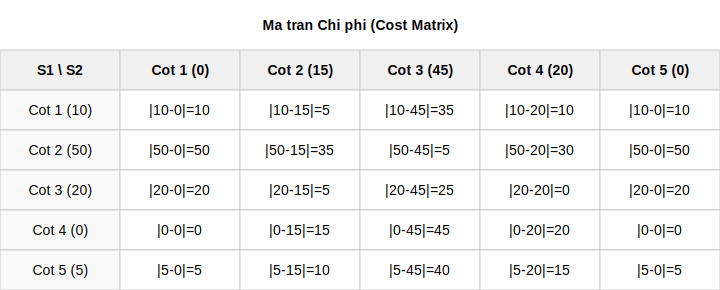

*(Bảng trên là ma trận chi phí Cost Matrix cho 5 cột này)*

*Biểu đồ đường trực quan thể hiện sự lệch pha:*

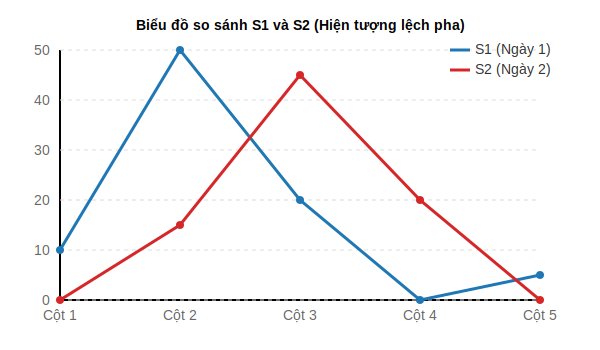

**Bước 6.2: Tìm Đường đi Uốn cong (Warping Path) bằng Quy hoạch động**

- Thay vì chỉ nhìn vào đường chéo chính (giống Euclidean), hệ thống phải tìm một con đường đi từ góc dưới cùng bên trái `(0, 0)` lên góc trên cùng bên phải `(47, 47)` sao cho tổng chi phí đi qua các ô là nhỏ nhất.

- **Quy tắc di chuyển:** Tại bất kỳ ô `(i, j)` nào, hệ thống chỉ được phép tiến lên theo 3 hướng: Sang phải, Đi lên, Đi chéo.

- Nhìn vào bảng trên, thuật toán sẽ chọn đi qua ô có giá trị **5** `(Cột 2 của S1 khớp với Cột 3 của S2)` thay vì khớp cứng nhắc Cột 2 với Cột 2 (chi phí 35). Nhờ vậy, hai đỉnh sóng bị lệch pha đã được khớp thành công.

*Biểu đồ đường hiển thị sự khớp nối DTW:*

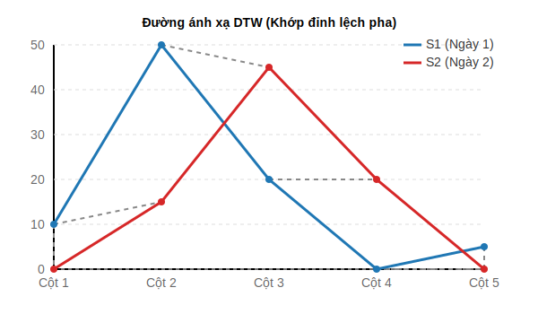

**Bước 6.3: Áp dụng Ràng buộc Cửa sổ Thời gian (Window Constraint - Tùy chọn)**
- Nếu để DTW tự do uốn cong, nó có thể lấy hành vi lúc 8:00 sáng khớp với hành vi lúc 22:00 đêm (điều này sai thực tế).

- Hệ thống áp dụng dải Sakoe-Chiba (hoặc cửa sổ ràng buộc). Ví dụ: Set window = 2 (tương đương lệch tối đa 1 tiếng).

- Khi đó, thuật toán sẽ cấm các đường đi chệch khỏi đường chéo chính quá 2 ô bằng cách gán chi phí Vô cực (`∞`).

*Ví dụ ma trận sau khi áp dụng ràng buộc (Window = 2):*

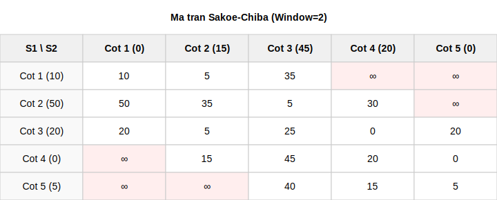

*Biểu đồ hiển thị vùng cho phép và vùng cấm (Sakoe-Chiba):*

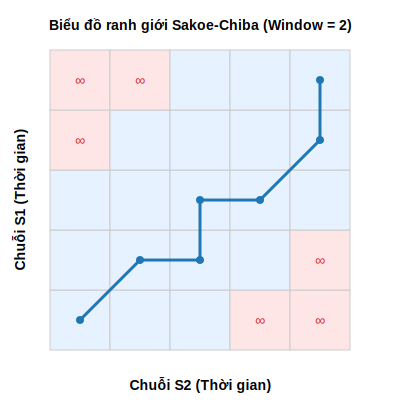

**Bước 6.4: Trích xuất Khoảng cách DTW Cuối cùng**

- Điểm đích `(47, 47)` của ma trận quy hoạch động sẽ chứa tổng chi phí nhỏ nhất. Đây chính là **Khoảng cách DTW**.

- Hệ thống thực hiện tính toán chéo cho *tất cả* các mảng 48-cột, thu được một **Siêu ma trận khoảng cách NxN**.

*Ví dụ Siêu ma trận khoảng cách DTW của Anh A - Web trong 4 ngày:*

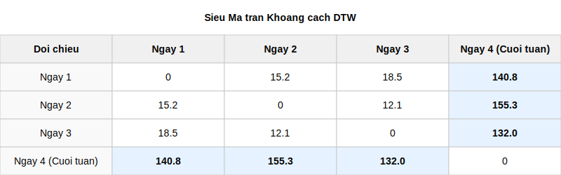

*(Dễ nhận thấy Ngày 4 có khoảng cách DTW cực kỳ lớn so với 3 ngày đầu do là ngày nghỉ cuối tuần)*

*Biểu đồ phân tán Không gian khoảng cách dựa trên ma trận trên:*

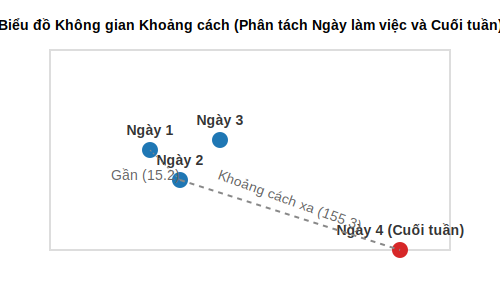

---

### Bước 7: Phân cụm Tự động bằng Thuật toán X-Means và Tiêu chuẩn BIC

Thay vì dùng K-Means thông thường yêu cầu người lập trình phải tự đoán và nạp trước số lượng nhóm K, hệ thống sử dụng thuật toán X-Means. X-Means sẽ bắt đầu từ một số lượng nhóm rất nhỏ (thường là K=2), sau đó tự động chẻ đôi các nhóm và dùng hàm toán học (Tiêu chuẩn BIC) để quyết định xem việc chẻ đôi đó có làm mô hình tốt lên không.

Công việc lập trình thực tế cho giai đoạn này bao gồm các bước nhỏ sau:

**Bước 7.1: Nạp Dữ liệu và Thiết lập Tham số Khởi tạo**

- **Hành động 1:** Hệ thống nạp **Siêu ma trận khoảng cách NxN** (đã thu được từ Bước 6). Trong ma trận này, khoảng cách giữa các mảng 48-cột đã được tính sẵn bằng DTW, do đó thuật toán X-Means ở đây (thực chất sẽ chạy trên nền K-Medoids) không cần tính lại khoảng cách Euclidean nữa mà chỉ việc tra cứu độ lệch pha từ ma trận này.

- **Hành động 2:** Thiết lập tham số ranh giới cho thuật toán: `K_min = 2` (số nhóm tối thiểu ban đầu) và `K_max` (giới hạn số nhóm tối đa để chống phân mảnh quá mức, ví dụ `K_max = 10` hoặc `15`).

**Bước 7.2: Chạy Thuật toán Gom cụm Cơ sở (Cấp độ 1)**

- Khởi tạo ngẫu nhiên 2 mảng dữ liệu (2 ngày bất kỳ) làm 2 "Tâm điểm" (Medoids) ban đầu.

- Quét qua toàn bộ các ngày còn lại, tra cứu trong Siêu ma trận xem ngày nào gần Tâm điểm 1 hơn thì phân vào **Cụm 1**, gần Tâm điểm 2 hơn thì phân vào **Cụm 2**.

- Hệ thống chạy vòng lặp cập nhật lại Tâm điểm mới cho mỗi cụm (chọn ngày nằm ở vị trí trung tâm nhất của cụm đó) và phân bổ lại các ngày. Vòng lặp dừng khi các cụm ổn định, không có sự hoán đổi thành viên.

*Ví dụ kết quả chạy thử lần 1:*

- **Cụm 1 (Ngày làm việc):** Ngày 1, Ngày 2, Ngày 3, Ngày 5

- **Cụm 2 (Cuối tuần):** Ngày 4, Ngày 6

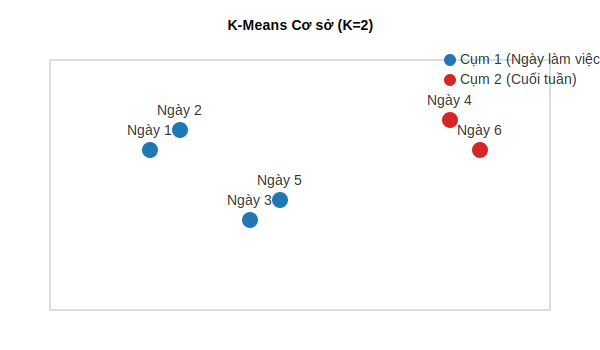

**Bước 7.3: Thử nghiệm Phân tách (Thuật toán Improve-Structure)**

- Hệ thống bốc **Cụm 1** ra và đặt giả thuyết: *"Nếu chẻ đôi Cụm 1 ra thành 2 cụm con, liệu việc phân nhóm có chuẩn xác hơn không?"*

- Nó cô lập dữ liệu của Cụm 1, tạm coi đó là một tập dữ liệu độc lập và chạy lại thuật toán gom cụm nội bộ (Local K-Means/K-Medoids) với K=2 chỉ áp dụng riêng cho các thành viên bên trong Cụm 1.

- Kết quả giả định, chia Cụm 1 thành:

  - **Cụm 1a (Làm việc sáng):** Ngày 1, Ngày 2

  - **Cụm 1b (Làm việc chiều):** Ngày 3, Ngày 5

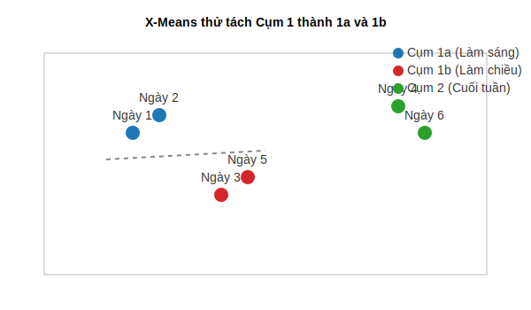

**Bước 7.4: Tính toán và So sánh bằng Tiêu chuẩn BIC (Bayesian Information Criterion)**

- Không dựa vào cảm tính để chia cụm, hệ thống cần một con số toán học để đo lường. Hàm BIC chấm điểm dựa trên công thức cốt lõi: **Độ hội tụ của dữ liệu (Likelihood - Điểm thưởng)** trừ đi **Độ phức tạp của mô hình (Penalty - Điểm phạt do gia tăng số lượng tham số/tâm điểm)**.

- Hệ thống chạy hàm tính toán:

  1. **Tính Điểm BIC(Cụm 1 gốc):** Ví dụ được **1500 điểm** (Dữ liệu bị phân tán rộng nên điểm thưởng thấp, nhưng ít bị phạt vì chỉ mang 1 Tâm điểm).

  2. **Tính Điểm BIC(Cụm 1a + Cụm 1b):** Ví dụ được **1850 điểm** (Các ngày co cụm rất chặt quanh 2 Tâm điểm mới, điểm thưởng hội tụ tăng vọt, lấn át hoàn toàn điểm phạt của việc đẻ thêm 1 Tâm điểm).

- **So sánh và Quyết định:** Hệ thống chạy lệnh `IF BIC(Chia đôi) > BIC(Giữ nguyên)`. Vì `1850 > 1500`, hệ thống quyết định xác nhận phương án chẻ đôi. Cụm 1 chính thức bị xóa sổ, nhường chỗ cho Cụm 1a và Cụm 1b.

**Bước 7.5: Vòng lặp Đệ quy (Recursion) và Điều kiện Hội tụ**

- Hệ thống đẩy các cụm mới (Cụm 1a, Cụm 1b) và cụm cũ chưa xét (Cụm 2) vào một hàng đợi (Queue).

- Vòng lặp bốc lần lượt từng cụm ra và quay lại **Bước 7.3** để tiếp tục thử chẻ đôi.

- **Điều kiện dừng (Hội tụ):**

  - Quá trình chẻ cụm sẽ lập tức bị hủy bỏ nếu `BIC(Chia đôi) < BIC(Giữ nguyên)`. Tình huống này xảy ra khi hệ thống cố tình chẻ nhỏ một nhóm vốn đã rất đồng nhất; điểm thưởng hội tụ không tăng lên bao nhiêu trong khi điểm phạt tăng mạnh, khiến tổng điểm BIC bị kéo tụt (ví dụ giảm từ 1850 xuống 1200).

  - Vòng lặp cũng sẽ ép dừng nếu tổng số lượng cụm hiện tại chạm đến trần `K_max`.
- **Kết quả đầu ra của Bước 7:** Hệ thống trả về một danh sách (List) phân chia chính xác từng ngày vào từng cụm hành vi tối ưu nhất (ví dụ: 4 cụm), hoàn toàn tự động mà không cần đoán trước số lượng cụm K.
---

### Bước 8: Tinh chỉnh và Chốt Nguyên mẫu B-Profile bằng DBA (DTW Barycenter Averaging)

Sau khi Bước 7 đã phân chia thành công các chuỗi hành vi vào từng cụm riêng biệt (ví dụ: Cụm 1a gồm Ngày 1, Ngày 2, Ngày 5), bước cuối cùng là phải tính ra một "Bản thiết kế" duy nhất đại diện cho cả cụm đó. Bản thiết kế này gọi là **B-Profile**.

Nếu ta sử dụng thuật toán Trung bình cộng (Average) thông thường, các đỉnh (spikes) dữ liệu bị lệch pha giữa các ngày sẽ bị triệt tiêu lẫn nhau và làm phẳng hoàn toàn biểu đồ. Do đó, hệ thống bắt buộc phải dùng thuật toán **DBA (DTW Barycenter Averaging)**.

Dưới đây là chi tiết các bước lập trình để chạy thuật toán DBA:

**Bước 8.1: Cô lập Dữ liệu và Khởi tạo Tâm điểm Giả định (Initial Sequence)**

- **Hành động 1:** Hệ thống bốc riêng dữ liệu của một cụm (ví dụ Cụm 1a) để xử lý. Các cụm khác sẽ được xử lý độc lập ở các luồng khác nhau.

- **Hành động 2:** Thay vì lấy trung bình ngay lập tức, hệ thống lập trình sẽ bốc ngẫu nhiên (hoặc chọn chuỗi có tổng khoảng cách DTW tới các chuỗi khác là nhỏ nhất) một mảng 48-cột bất kỳ trong Cụm 1a làm Tâm điểm tạm thời, gọi là mảng `C_tmp`.

- *Ví dụ:* Chọn Ngày 1 làm `C_tmp` ban đầu. `C_tmp = [10, 50, 20, 0, 5]` (có một đỉnh dữ liệu lướt web là 50 requests nằm ở Index số 1).

**Bước 8.2: Ánh xạ bằng DTW (DTW Warping Path Assignment)**

- Ở bước này, hệ thống không cộng thẳng các cột cùng Index với nhau. Nó duyệt qua từng ngày còn lại trong Cụm 1a (ví dụ Ngày 2, Ngày 5) và chạy thuật toán DTW giữa ngày đó với mảng `C_tmp`.

- **Hành động:** Thuật toán DTW sẽ tìm ra **Đường đi Uốn cong (Warping Path)**. Đường đi này là một danh sách tọa độ chỉ ra chính xác cột nào của Ngày 2 đang "khớp" (tương đồng về mặt hình thái) với cột nào của `C_tmp`.

- *Ví dụ:* Đỉnh lướt web của Ngày 2 có giá trị là **45**, nhưng hôm đó người dùng lướt web trễ hơn nên nó nằm ở Index số 2. Nhờ Warping Path, code phát hiện ra rằng **Cột Index 2 của Ngày 2** thực chất là hệ quả của cùng một hành vi tương ứng với **Cột Index 1 của `C_tmp`**.

**Bước 8.3: Cập nhật Trọng tâm (Barycenter Update)**

- Sau khi có danh sách ánh xạ, hệ thống tiến hành cập nhật lại giá trị cho từng cột của mảng `C_tmp`.

- **Hành động:** Đối với mỗi Cột thứ `i` của `C_tmp`, hệ thống sẽ gom tất cả các giá trị từ các ngày khác mà đã được thuật toán DTW "chỉ định" là khớp với Cột `i`. Sau đó, nó tính trung bình cộng của tập hợp các giá trị vừa gom được đó.

- *Ví dụ:*
  - Cột Index 1 của `C_tmp` đang mang giá trị 50 (Ngày 1).

  - Qua phép ánh xạ, nó được gom chung với Cột Index 2 của Ngày 2 (đang mang giá trị 45).

  - Giá trị mới tại Cột Index 1 của `C_tmp` được cập nhật thành: `(50 + 45) / 2 = 47.5`.

*Bảng minh họa sức mạnh của DBA so với tính Trung bình cộng thông thường:*

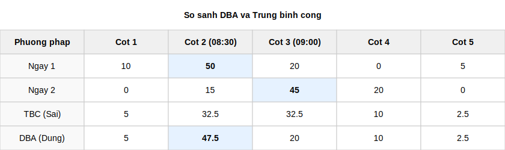

*Biểu đồ hiển thị sự khác biệt: Tính Trung bình làm phẳng đỉnh, trong khi DBA giữ nguyên được đỉnh nhọn thực tế:*

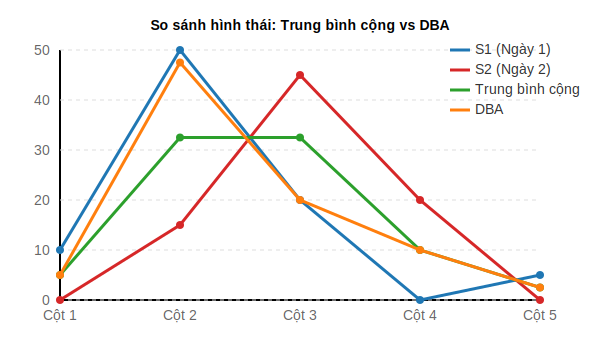

*(Chú ý trực quan: Phép tính trung bình cộng thông thường ép cứng Cột 1 cộng với Cột 1, Cột 2 cộng với Cột 2, khiến hai đỉnh 50 và 45 bị chia đôi cho 0, tự triệt tiêu lẫn nhau và xẹp xuống chỉ còn 32.5. Trong khi đó, hệ thống lập trình DBA gom thành công hai đỉnh bị lệch pha lại thành một đỉnh nhọn **47.5** ở chính giữa, phản ánh chính xác bản chất cường độ hành vi của người dùng).*

**Bước 8.4: Chu trình Lặp đến khi Hội tụ (Iteration to Convergence)**

- **Vòng lặp:** Mảng `C_tmp` sau khi được cập nhật (chứa đỉnh 47.5) sẽ tiếp tục được nạp làm Tâm điểm mới cho vòng lặp tiếp theo. Hệ thống lại mang `C_tmp` mới này đi chạy DTW với Ngày 1, Ngày 2, Ngày 5 và lặp lại quá trình ánh xạ, cập nhật trọng tâm.

- **Điều kiện dừng:** Hệ thống lặp lại vòng lặp 8.2 và 8.3 này (thường mất từ 10 đến 30 vòng lặp) liên tục cho đến khi các giá trị bên trong mảng `C_tmp` **không còn sự thay đổi nữa** (hoặc mức độ chênh lệch giữa 2 vòng lặp liên tiếp rất bé, tiệm cận 0).

- **KẾT QUẢ CUỐI CÙNG:** Ngay khi vòng lặp kết thúc, mảng `C_tmp` hội tụ cuối cùng đó chính thức được xuất ra và dán nhãn là **B-Profile** của Cụm 1a. Hệ thống sau đó lặp lại tự động toàn bộ quy trình này cho Cụm 1b, Cụm 2,... để hoàn tất việc lập Hồ sơ Hành vi cho toàn bộ tập dữ liệu.
