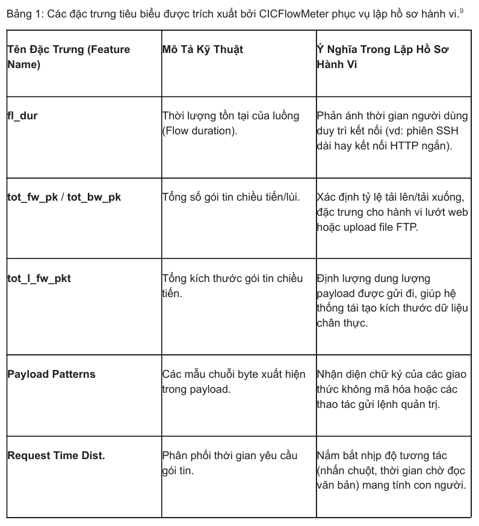
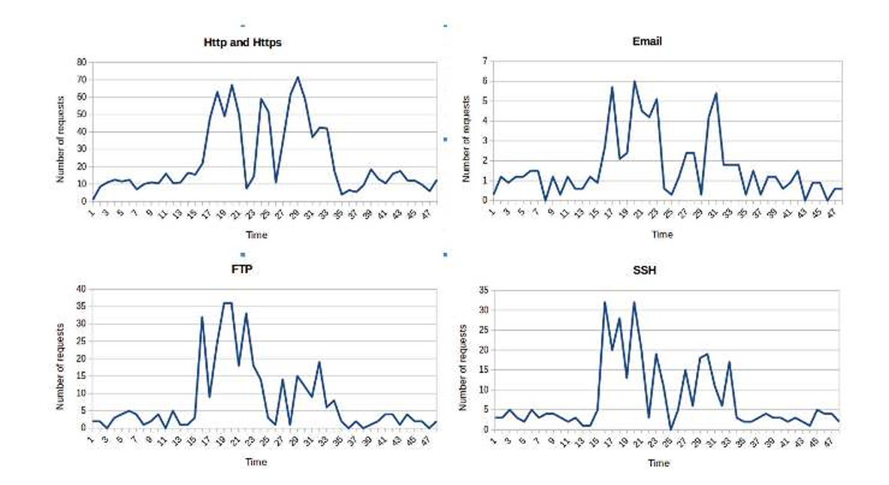
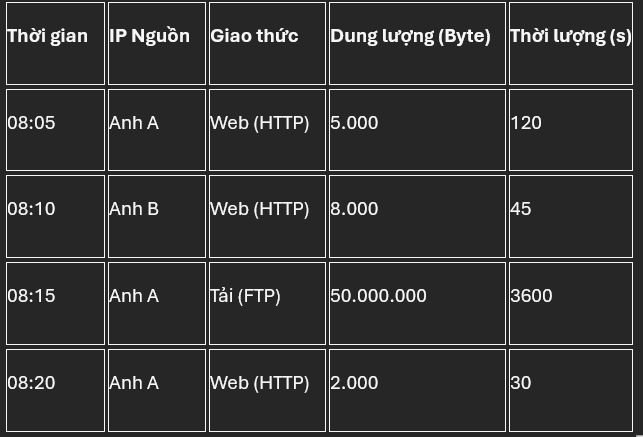
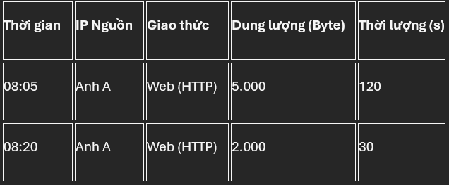
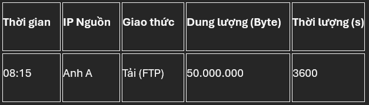
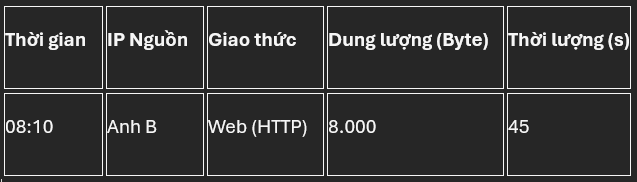

### Đây là một bài review lại bài báo của các tác giả Iman Sharafaldin, Amirhossein Gharib, Arash Habibi Lashkari and Ali A. Ghorbani. Mục đích là để tìm hiểu kỹ thuật tạo B-Profile nhằm dùng thuật toán để gom nhóm hành vi bình thường, phục vụ cho dự án của EdgeAI Lab.

**Nhận định:** Để đánh giá hiệu năng của một hệ thống phát hiện xâm nhập mạng thì cách lý tưởng nhất là sử dụng lưu lượng mạng thực tế đã được gắn nhãn, có khả năng phản ánh đầy đủ dấu hiệu của các hành vi bất thường hay bình thường.

> Tuy nhiên thì tính khả thi rất thấp, gần như bằng 0 do các ràng buộc, bí mật thuộc các tập đoàn và tổ chức. Do đó thì phần lớn sẽ phải phụ thuộc vào các tập dữ liệu chuẩn được công khai (thường không tối ưu, không phản ánh đúng tính chất mạng)

> Thêm một điều rút ra được là các mẫu hành vi, cấu trúc mạng, các cuộc tấn công liên tục biến đổi, nên việc phụ thuộc vào một tập dữ liệu tĩnh, thu thập một lần rồi sử dụng vĩnh viễn là không khả quan, thậm chí mang lại kết quả sai lệch khi áp dụng học máy.

### Phương pháp tạo B-Profile

**Giai đoạn khởi tạo:** Thu thập đặc trưng luồng và phương pháp biểu diễn chuỗi thời gian 48-cột

- Bước đầu tiên chính là giai đoạn lập hồ sơ cá nhân. Hệ thống phải quan sát người dùng thực trong một môi trường được kiểm soát chặt chẽ để thu thập dữ liệu về cách họ tương tác với các ứng dụng.

> Hệ thống bắt buộc phải quan sát người dùng thật ở giai đoạn đầu. Để tạo ra nền đủ đa dạng, hệ thống ước tính có thể cần phải quan sát hàng trăm, hàng ngàn người. Lý do là vì hành vi mạng của con người rất phong phú và thay đổi liên tục theo từng múi giờ, và sở thích cá nhân của mỗi người.

> Hệ thống sẽ ghi nhận hoạt động của các cá nhân trong suốt 24 giờ. Quá trình này diễn ra trong phòng thí nghiệm.

Tuy nhiên nếu làm theo cách trên thì thực sự là không tưởng về mặt thực tế.

**Do đó phương pháp này là không khả quan, ta sẽ đi theo cách sau:**

### Bước 1: Giám sát và thu thập dữ liệu thô

**1.** Khi hệ thống thu thập dữ liệu mạng, nó sẽ thiết lập bộ lọc để chỉ ghi nhận và phân tích lưu lượng đi qua các cổng (ports) của 5 nhóm giao thức và phớt lờ các luồng dữ liệu khác.

- HTTP / HTTPS (Port 80/443): Đại diện cho hành vi lướt web, mở trình duyệt.

- FTP (Port 20/21): Đại diện cho hành vi truyền tải, upload/download tệp tin nội bộ.

- SSH (Port 22): Đại diện cho hành vi thao tác terminal, điều khiển máy tính/máy chủ từ xa.

- Email (SMTP, IMAP, POP3): Đại diện cho hành vi gửi, nhận và đồng bộ thư điện tử.

**2.** Các phương pháp được sử dụng để thu thập dữ liệu: tấn công Man-in-the-Middle, đánh hơi mạng (network sniffing) và đối chiếu với lịch sử duyệt web cũng như email cua người dùng.

> Network Sniffing sẽ là phương pháp được sử dụng chủ yếu nhờ sự đơn giản của nó, và những lợi ích nó mang lại là vừa đủ. Tấn công Man-in-the-middle và đối chiếu lịch sử sễ chỉ được sử dụng ở mức phòng thí nghiệm, theo bài báo thì có thể là lên các tình nguyện viên hoặc chính các tác giả. Tuy nhiên 2 phương pháp này vẫn bắt buộc phải có.

**Giải thích 2 phương pháp**

**2.1** Network Sniffing: Hệ thống đóng vai trò như một người quan sát đứng bên lề đường, ghi chép lại lưu lượng giao thông truyền qua lại mà không hề can thiệp, chặn đứng hay làm thay đổi tốc độ của luồng dữ liệu. Các tác giả sẽ cài đặt các phần mềm hoặc thiết bị bắt gói tin (packet sniffer) tại các điểm định tuyến trung tâm của hệ thống mạng. Khi người dùng bình thường sử dụng mạng để lướt web, tải file hay gửi mail, thiết bị này sẽ tự động bắt và sao chép lại toàn bộ luồng dữ liệu đó. Nhờ vậy mà phuowg pháp này giải quyết được vấn đề số lượng người dùng mạng (Có thể lên đến 100-1000 để đảm bảo tính đa dạng).

**2.2** MITM: MITM là kỹ thuật chủ động can thiệp thẳng vào giữa đường truyền kết nối của người dùng và máy chủ đích. Phương pháp này được thiết lập và giới hạn nghiêm ngặt trong một môi trường thử nghiệm. Hệ thống của tác giả sẽ đóng giả làm trạm trung chuyển. Khi thiết bị của người dùng gửi yêu cầu ra internet, kết nối đó sẽ bị bẻ hướng đi qua máy của nhà nghiên cứu trước. Máy trung gian này sẽ nhận gói tin, giải mã chúng, ghi chép lại nội dung bên trong, sau đó mới đóng gói lại và gửi tiếp đến máy chủ đích thực sự. Vì phương pháp này đòi hỏi việc đọc nội dung bên trong các gói tin, nó chỉ có thể được sử dụng ở trong môi trường phòng thí nghiệm.

**Nhược điểm của Network Sniffing**: NS không thể nhìn thấy các Payload Patterns đối với các lệnh đặc thù.

**Nhược điểm đó có ảnh hưởng như nào đến quá trình nghiên cứu**: Mục đích sau đó chính là phân loại các gói tin cho chuẩn (Ta sẽ dùng công cụ CICFlowMEter). Công cụ này cần bắt được chữ ký của các giao thức không mã hóa hoặc các thao tác gửi lệnh quản trị để nhận diện chính xác hành vi đó là gì. Nếu không có ruột, NS chỉ thấy một đống gói tin bằng nhau và không biết đâu là lướt web, đâu là gửi lệnh quản trị.

**MIRTM giải quyết vấn đề đó như nào**: Đầu tiên các tác giả/ các tình nguyện viên sẽ đóng vai để thực hiện các thao tác. MITM đứng ở giữa bẻ khóa và nhìn ra các mẫu chuỗi byte đặc biệt. Làm nhiều lần như vậy, ta sẽ rút ra được các chữ ký đại diện cho từng loại hành động. Sau đó, ta đem tập hợp này để dạy cho CICFlowMeter. Nhờ đó mà mặc dù gói tin (do NS bắt) bị khóa một phần, CICFlowMeter vẫn sẽ đủ thông minh để đối chiếu các manh mối với từ điển do MITM cấp, nhận diện và dán nhãn luồng.

**3.** Cuối cùng, đầu ra của công đoạn này là các tệp dữ liệu mạng thô (PCAP) gồm vỏ ngoài của gói tin (nhờ NS) và danh sách Payload Patterns (nhờ MITM).

### Bước 2: Trích xuất Đặc trưng bằng CICFlowMeter.

**1.**: Chia luồng dữ liệu:

> CICFlowMeter gom tất cả các gói tin có chung 5 yếu tố (IP Nguồn, Cổng nguồn, IP Đích, Cổng đích, Giao thức) thành một luồng. Việc này nhằm chuyển đổi góc nhìn của hệ thống từ Packet-Level sang Flow-Level. Những thông số này được lấy từ NS.

**2.**: Trích xuất các đặc trưng cốt lõi:

> Đối với mỗi luồng đã gom được, CICFlowMeter phân tích tầng mạng (network layer) và tầng giao vận(transport layer) để tính toán ra hơn 80 đặc trưng thống kê và vật lý(Bài báo không nói rõ 80 đặc trưng này là gì, nhưng nó là các con số thống kê thiết kế sẵn trong phần mềm CICFlowMeter). Đối với việc chỉ xây dựng B-Profile thì tập trung vào các nhóm thông số bao gồm: thời lượng luồng, tổng số gói tin theo chiều đi/về, tổng kích thước gói tin theo chiều đi, các mẫu cụ thể trong payload và phân phối thời gian.

### Bước 3: Biểu Diễn Hành Vi Dưới Dạng Chuỗi Thời Gian.

**Mô tả qua ý tưởng:** Đầu vào cho bước này là các hành vi của người dùng liên quan đến các giao thức đã đề cập. Hoạt động mạng của mỗi người dùng được ghi lại hàng ngày (theo ngày và giao thức) và một biểu đồ tần suất của các sự kiện với 48 cột (mỗi 30 phút) được tính toán. Hình bên dưới hiển thị hồ sơ cá nhân của một người dùng trong một ngày.

**Bước 3.1**: Tác giả viết một hệ thống (có thể bằng python và dùng các thư viện như Pandas hoặc NukPy) để nạp file CSV (Đầu ra của CICFlowMeter). Hệ thống sẽ chạy lệnh drop để bỏ phần lớn các thông số không quan trọng (như độ dài header TCP, số lượng cờ URG...). Nó chỉ giữ lại các cột: Timestamp (thời gian), IP Nguồn, Giao thức, và 4 nhóm thông số hạt nhân: Thời lượng luồng (fl_dur), Dung lượng/Số gói tin (tot_fw_pk, tot_l_fw_pkt...), Nhịp độ (Request Time Dist), và Mẫu Payload.

**Bước 3.2**: Tách nhóm theo đối tượng và hành vi: Vì lúc này tập dữ liệu rất lộn xộn: các luồng mạng (network flows) của tất cả người dùng trong hệ thống và mọi loại tác vụ mạng đang nằm đan xen lẫn nhau theo trình tự thời gian thu thập thụ động. Hệ thống sẽ chạy lệnh gom nhóm groupby(['IP Nguồn', 'Giao thức']). Lệnh này sử dụng một "khóa tổng hợp" (composite key) làm tiêu chí phân loại, bao gồm hai trường dữ liệu bắt buộc: Địa chỉ IP Nguồn và Loại Giao thức.

> Từ một tập dữ liệu nguyên khối và lộn xộn ban đầu, hệ thống xuất ra hàng loạt các tập dữ liệu con có tính đồng nhất cao. Mỗi tập dữ liệu con lúc này mang tính chất độc lập tuyệt đối: Chỉ chứa duy nhất lịch sử hoạt động của một người dùng xác định đối với một loại giao thức xác định. Dữ liệu đã ở trạng thái tối ưu để chuyển sang bước ánh xạ lên trục chuỗi thời gian.

**Ví dụ về cách hệ thống hoạt động**:

Bảng gốc (Chưa được sắp xếp):

**KẾT QUẢ SAU KHI CHẠY LỆNH GROUP BY**

- [Anh A - Web]

- [Anh A - FTP]

- [Anh B - Web]

**Bước 3.3**: Time Binning

> Ý tưởng: Thay vì lưu trữ chuỗi log khổng lồ, hệ thống tính toán một biểu đồ tần suất (histogram) gồm chính xác 48 cột (48 bars) cho mỗi 24 giờ.6 Khung thời gian một ngày được chia nhỏ thành các khoảng thời gian (bin) bằng nhau, với mỗi cột đại diện cho một khoảng thời gian 30 phút.6 Các hành vi mạng như số lượng kết nối HTTP hay dung lượng truyền FTP được tổng hợp và phân bổ vào các cột tương ứng theo thời gian thực thi.

- Bước 3.3.1: Hệ thống thiết lập một chu kỳ chuẩn hóa là 24 giờ. Trục thời gian này được chia cắt thành các khoảng thời gian rời rạc (time bins) có độ rộng cố định là 30 phút. Tổng cộng có 48 phân vùng được tạo ra, và hệ thống sẽ đánh chỉ số (Index) cho các phân vùng này bằng các số nguyên chạy từ 0 đến 47 (trong đó Index 0 đại diện cho mốc 00:00 - 00:29, Index 1 là 00:30 - 00:59,... và Index 47 là 23:30 - 23:59).

- Bước 3.3.2: Tập lệnh quét qua cột Timestamp của từng hàng dữ liệu. Hệ thống tiến hành loại bỏ các thành phần bao gồm: Ngày, Tháng, Năm (vì mục tiêu là tìm kiếm thói quen sinh hoạt lặp lại trong một ngày, không phụ thuộc vào ngày lịch cụ thể) và Giây (vì độ phân giải này quá nhỏ, gây nhiễu). Hệ thống chỉ giữ lại hai tham số cốt lõi để tính toán: Giờ (giá trị từ 0 đến 23) và Phút (giá trị từ 0 đến 59).

- Bước 3.3.3: Để biết chính xác luồng mạng rơi vào phân vùng nào, hệ thống đưa hai tham số vào hàm sau:

> Index = Phần nguyên của [(Giờ * 60 + Phút) / 30]

- Bước 3.3.4: Sau khi công thức toán học trả về kết quả (từ 0 đến 47), hệ thống sẽ gán con số này thành một thẻ chỉ số (Index tag) mới cho hàng dữ liệu đó.

### Bước 4: 